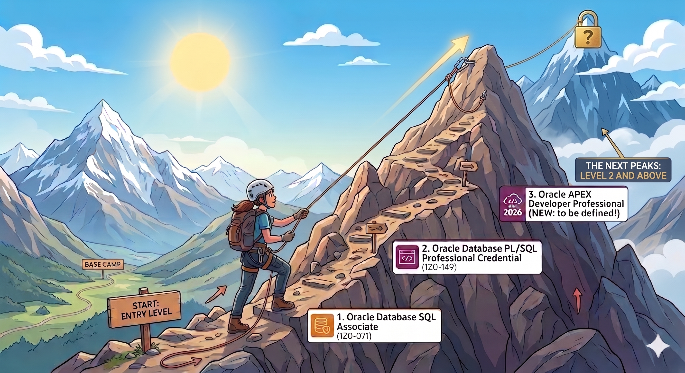

# Level 1: Foundations (year 1)

Level 1 is the **mandatory foundation** every Radicler must complete during their first year. It covers the core Oracle stack we build on every day: SQL, PL/SQL, and APEX.

All courses live on **[Oracle MyLearn](https://mylearn.oracle.com)**. Make sure you have registered there with your `@radicle.it` email before starting (see the [README](../README.md)).

## Certifications

Deadlines are **relative to your start date at Radicle**.

| # | Certification | Exam code | Deadline | Course on Oracle MyLearn |
|---|---|---|---|---|
| 1 | Oracle Database SQL Associate Credential | `1Z0-071` | within **3 months** of joining | [Open on MyLearn](https://mylearn.oracle.com/ou/learning-path/earn-the-oracle-database-sql-associate-credential/80636) |
| 2 | Oracle Database PL/SQL Professional Credential | `1Z0-149` | within **6 months** of joining | [Open on MyLearn](https://mylearn.oracle.com/ou/learning-path/earn-the-oracle-database-plsql-professional-credential/80834) |
| 3 | Oracle APEX Developer Professional 2026 | _new, to be defined_ | within **9 months** of joining | [Open on MyLearn (2025 ver.)](https://mylearn.oracle.com/ou/learning-path/become-an-oracle-apex-developer-professional-2025/146080) |

## Notes

- The **APEX Developer Professional 2026** track is new for 2026. While we wait for Oracle to release it, the link above points to the current **2025 version** of the learning path. The exam code and link will be updated here as soon as the 2026 edition is published.
- **Order matters**: SQL first, then PL/SQL, then APEX. Each builds on the previous one.
- If you hit a blocker (course unavailable, exam date conflict, etc.), flag it to your mentor early. Deadlines can be discussed; drifting silently cannot.
